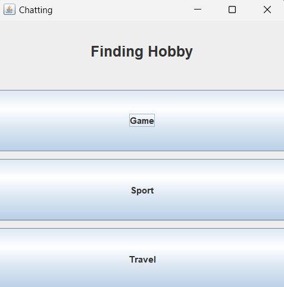

### 실행 방법
1. 서버를 먼저 실행한다. (각 서버의 main 메서드 실행)
2. src/main/java/chatting/view에 있는 View.java의 main 메서드를 실행하면 메인 화면이 나오게 된다.
   (가끔 하얀 화면이 나올 때가 있는데, 그 때는 재시작하면 해결됨)
3. 원하는 채널을 선택한 뒤에 입장하여 채팅을 보낸다.

### 실행 화면
- 메인 화면
  